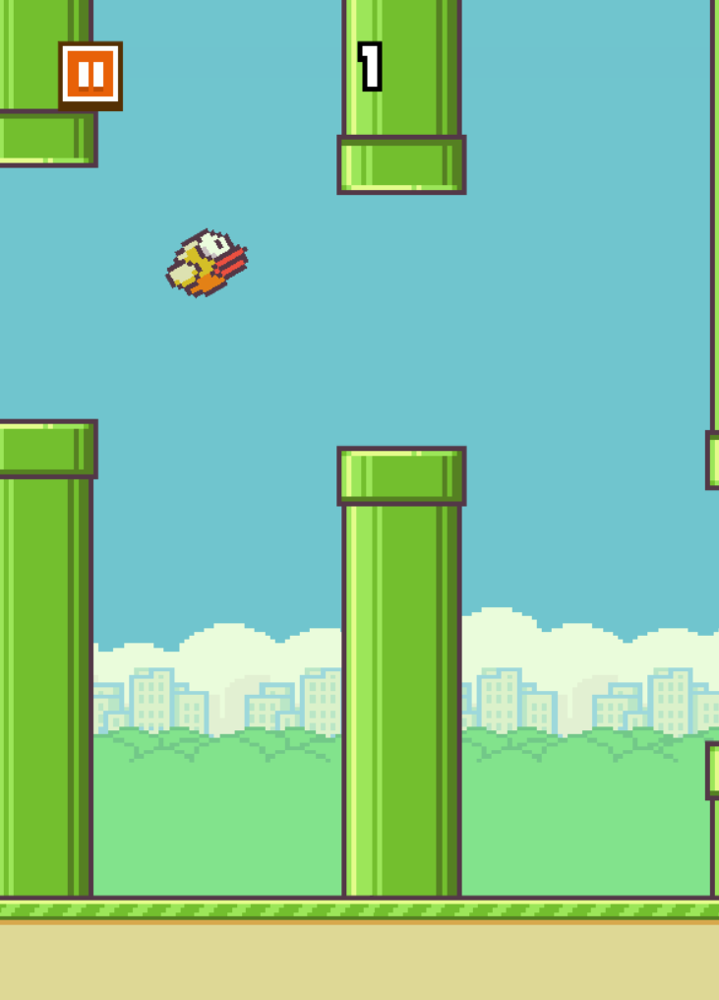
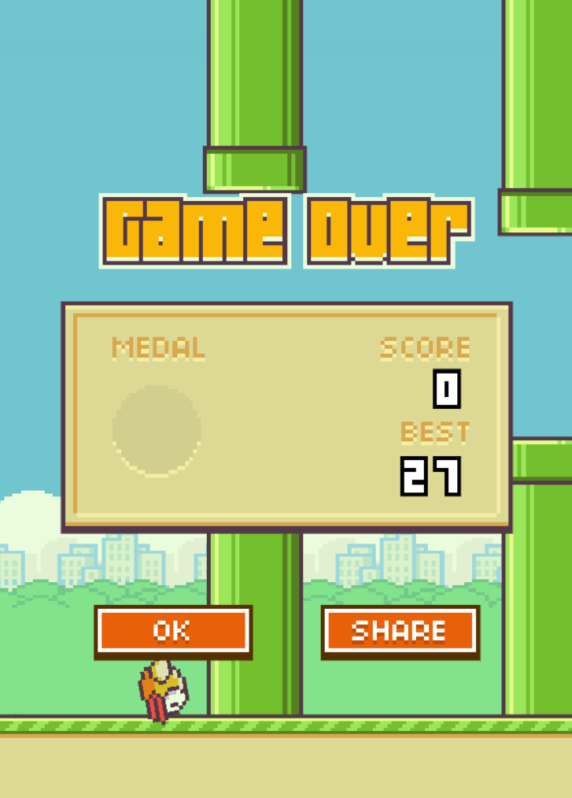

<p float="left">



</p>

## Try online

https://flappy-zeta.vercel.app/

## Note

Please lower your refresh rate, the flap is so fast on Gaming laptop, I haven't worked my way around it. Use your phone.

## Prerequisites

- Nodejs
- `pnpm` or `npm` package manager

## Installation

```bash
npm install # or pnpm install or yarn install

```

### Learn more on the [Solid Website](https://solidjs.com) and come chat with us on our [Discord](https://discord.com/invite/solidjs)

## Available Scripts

In the project directory, you can run:

### `npm run dev`

Runs the app in the development mode.<br>
Open [http://localhost:5173](http://localhost:5173) to view it in the browser.

### `npm run build`

Builds the app for production to the `dist` folder.<br>
It correctly bundles Solid in production mode and optimizes the build for the best performance.

The build is minified and the filenames include the hashes.<br>
Your app is ready to be deployed!

## Deployment

Learn more about deploying your application with the [documentations](https://vitejs.dev/guide/static-deploy.html)
